Datos Energía, S.A
================
Luis Pedro Zenteno
10/6/2021

\#Limpiar formato y tipo de datos

``` r
library(dplyr)
library(highcharter)
library(tidyverse)
library(readr)
library(formattable)
library(lubridate)
library(knitr)
library(stringr)

df<-read_delim("c1.csv",",",escape_double=FALSE,trim_ws=TRUE)
df$Fecha<-dmy(df$Fecha)
df$Camion_5<-as.numeric(str_remove(df$Camion_5,pattern = "Q")) 
df$Pickup<-as.numeric(str_remove(df$Pickup,pattern = "Q"))
df$Moto<-as.numeric(str_remove(df$Moto,pattern = "Q")) 
df$factura<-as.numeric(str_remove(df$factura,pattern = "Q")) 
df$directoCamion_5<-as.numeric(str_remove(df$directoCamion_5,pattern = "Q")) 
df$fijoCamion_5<-as.numeric(str_remove(df$fijoCamion_5,pattern = "Q")) 
df$directoPickup<-as.numeric(str_remove(df$directoPickup,pattern = "Q")) 
df$fijoPickup<-as.numeric(str_remove(df$fijoPickup,pattern = "Q")) 
df$directoMoto<-as.numeric(str_remove(df$directoMoto,pattern = "Q")) 
df$fijoMoto<-as.numeric(str_remove(df$fijoMoto,pattern = "Q")) 
```

# Conversión a Tidy Data

``` r
tidy_df<-df %>% 
  pivot_longer(c(`Camion_5`, `Pickup`,`Moto` ), names_to = "Transporte", values_to = "CostoTotal") %>% 
  pivot_longer(c(`5-30`, `30-45`,`45-75`,`75-120`,`120+`), names_to = "TiempoRecorrido", values_to = "n") %>% 
  pivot_longer(c(`directoCamion_5`, `directoPickup`,`directoMoto` ), names_to = "Directo", values_to="CostoDirecto") %>%
  pivot_longer(c(`fijoCamion_5`, `fijoPickup`,`fijoMoto` ), names_to = "Fijo", values_to="CostoFijo") %>% 
  filter(n>0) %>% 
  filter(CostoTotal>0) %>% 
  filter(CostoDirecto>0) %>% 
  filter(CostoFijo>0)

tidy_df<-tidy_df %>% 
  select(Fecha,ID,Transporte,Cod,CostoTotal,CostoDirecto,CostoFijo,origen,Lat,Long,factura,height,TiempoRecorrido)
```

\#Precios promedio por servicio y a lo largo del tiempo igual que ver
costos

``` r
tidy_df$utilidad<-tidy_df$factura-tidy_df$CostoTotal

precio_promedio<-tidy_df %>% 
  group_by(Cod) %>% 
  summarise(preciopromedio=mean(factura)) %>% 
  arrange(-preciopromedio)

grafica_precio_promedio<-precio_promedio %>% 
    hchart("column",hcaes(Cod,preciopromedio)) %>% 
    hc_title(text="Precio promedio por servicio" ) %>% 
    hc_subtitle(text="")

costo_promedio<-tidy_df %>% 
  group_by(Cod) %>% 
  summarise(costopromedio=mean(CostoTotal)) %>% 
  arrange(-costopromedio)

grafica_costo_promedio<-costo_promedio %>% 
    hchart("column",hcaes(Cod,costopromedio)) %>% 
    hc_title(text="Costo promedio por servicio" ) %>% 
    hc_subtitle(text="") %>% 
    hc_colors(c("#FF7F50"))

margen_por_servicio<-left_join(precio_promedio,costo_promedio)
```

    ## Joining, by = "Cod"

``` r
margen_por_servicio<-margen_por_servicio %>% 
  mutate(margen_servicio= percent(1-(costopromedio/preciopromedio))) %>% 
  select(Cod,margen_servicio) %>% 
  arrange(-margen_servicio)

kable(precio_promedio)
```

| Cod                       | preciopromedio |
| :------------------------ | -------------: |
| CAMBIO\_PUENTES           |       176.8795 |
| OTRO                      |       176.7601 |
| VISITA\_POR\_CORRECCION   |       176.5216 |
| REVISION\_TRANSFORMADOR   |       157.2363 |
| CAMBIO\_FUSIBLE           |       153.3957 |
| VERIFICACION\_INDICADORES |       141.9205 |
| REVISION                  |       132.5588 |
| VERIFICACION\_MEDIDORES   |       131.6008 |
| VISITA                    |       128.3638 |
| CAMBIO\_CORRECTIVO        |       124.5039 |

``` r
kable(margen_por_servicio)
```

| Cod                       | margen\_servicio |
| :------------------------ | ---------------: |
| CAMBIO\_FUSIBLE           |           29.09% |
| VISITA\_POR\_CORRECCION   |           25.48% |
| OTRO                      |           24.98% |
| VERIFICACION\_INDICADORES |           23.05% |
| CAMBIO\_PUENTES           |           23.02% |
| CAMBIO\_CORRECTIVO        |           22.64% |
| VISITA                    |           22.50% |
| REVISION\_TRANSFORMADOR   |           22.47% |
| REVISION                  |           22.16% |
| VERIFICACION\_MEDIDORES   |           21.89% |


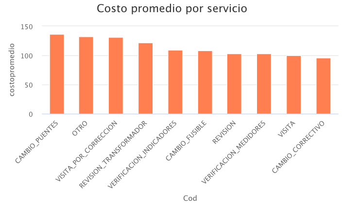

\#que tipo de mantenimiento nos da más ingresos, como se comporto por el
de más
margen.

``` r
## ingresos constantes para cada servici, lo que se puede sacar aca es aumentar ellos que tengan más margen.
ingreso_total<-sum(tidy_df$factura)
costo_total<-sum(tidy_df$CostoTotal)

cantidad_mensual<-tidy_df %>% 
  group_by(Cod,mes=month(Fecha,label = TRUE)) %>% 
  summarise(servicios=n())
```

    ## `summarise()` has grouped output by 'Cod'. You can override using the `.groups` argument.

``` r
grafica_cantidad<-cantidad_mensual %>% 
  hchart('line', hcaes(mes,servicios, group = Cod)) %>%
  hc_colors(c("#0073C2FF", "#EFC000FF","#FF7F50","  #00FFFF","#191970","    #7FFFD4","#FF7F50","#BDB76B","#BA55D3","#006400")) %>% 
    hc_title(text="SCantidad de servicios mensuales" )


utilidad_mensual<-tidy_df %>% 
  group_by(Cod,mes=month(Fecha,label = TRUE)) %>% 
  summarise(utilidad_promedio=sum(utilidad))
```

    ## `summarise()` has grouped output by 'Cod'. You can override using the `.groups` argument.

``` r
utilidad_mensual_revision<-tidy_df %>% 
  group_by(Cod) %>% 
  summarise(ingreso=sum(factura))

ingresos_revisión<-sum(utilidad_mensual_revision$ingreso)

grafica_utilidad<-utilidad_mensual %>% 
  hchart('line', hcaes(mes,utilidad_promedio, group = Cod)) %>%
  hc_colors(c("#0073C2FF", "#EFC000FF","#FF7F50","  #00FFFF","#191970","    #7FFFD4","#FF7F50","#BDB76B","#BA55D3","#006400")) %>% 
    hc_title(text="Utilidad promedio mensual por servicio" )

 comportamiento_servicios<-tidy_df %>% 
  group_by(Cod,mes=month(Fecha,label = TRUE)) %>% 
  summarise(ingresos=sum(factura)) %>% 
  arrange(-mes,) 
```

    ## `summarise()` has grouped output by 'Cod'. You can override using the `.groups` argument.

    ## Warning in Ops.ordered(mes): '-' is not meaningful for ordered factors

``` r
grafica_servicios_comp<-comportamiento_servicios %>% 
  hchart('line', hcaes(mes,ingresos, group = Cod)) %>%
  hc_colors(c("#0073C2FF", "#EFC000FF","#FF7F50","  #00FFFF","#191970","    #7FFFD4","#FF7F50","#BDB76B","#BA55D3","#006400")) %>% 
    hc_title(text="Ingresos mensaules por servicio" )
```

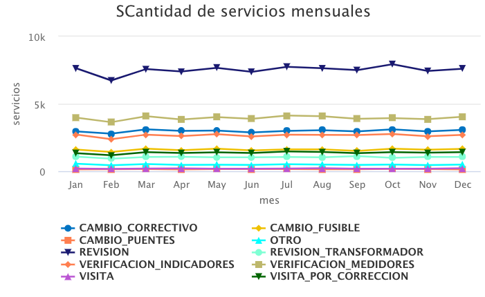
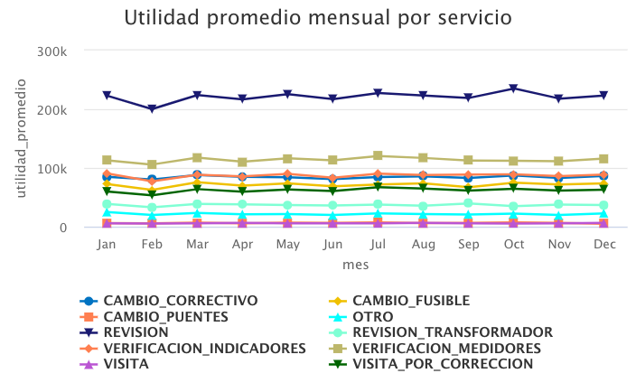

# Ingresos vs Gastos mensual y análisis de margen anual

``` r
#el margen ha sido el mismo todos los meses

# julio se puede observar que el cambio es significativo dados los costos.

utilidades_mensuales<-tidy_df %>% 
  group_by(mes=month(Fecha,label = TRUE)) %>% 
  summarise(ingresos=sum(factura),costos=sum(CostoTotal),margen=1-(sum(CostoTotal)/sum(factura)))

grafica_ingresos_mensuales<-utilidades_mensuales %>% 
  hchart('line', hcaes(mes,ingresos)) %>% 
  hc_colors(c("#0073C2FF", "#EFC000FF")) %>% 
    hc_title(text="Ingresos") 

grafica_costos_mensuales<-utilidades_mensuales %>% 
  hchart('line', hcaes(mes,costos)) %>% 
  hc_colors(c("#0073C2FF", "#EFC000FF")) %>% 
    hc_title(text="Costos") 

grafica_margen_mensuales<-utilidades_mensuales %>% 
  hchart('line', hcaes(mes,margen)) %>% 
  hc_colors(c("#0073C2FF", "#EFC000FF")) %>% 
    hc_title(text="Margen mensual") 
```

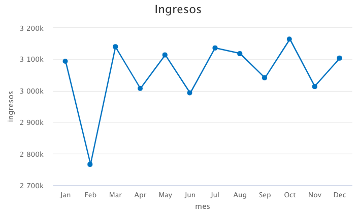 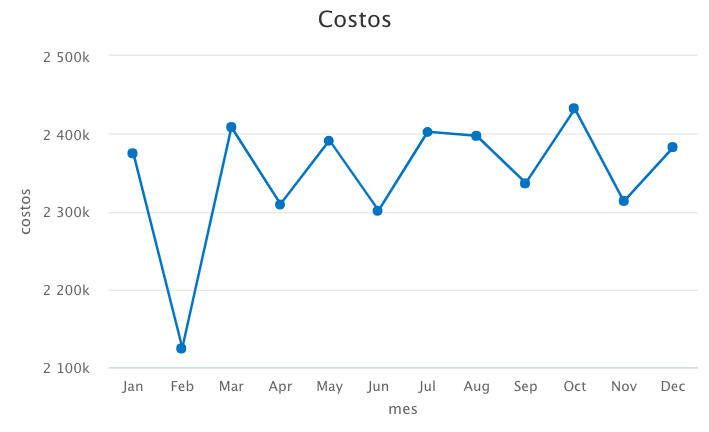
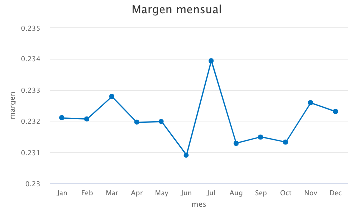

# Analisis de fijo y costo directo

``` r
costos<-tidy_df %>% 
  group_by(mes=month(Fecha,label = TRUE)) %>% 
  summarise(fijos=mean(CostoFijo),directos=mean(CostoDirecto))

grafica_costos_fijoss<-costos %>% 
  hchart('line', hcaes(mes,fijos)) %>% 
  hc_colors(c("#0073C2FF", "#EFC000FF")) %>% 
    hc_title(text="Costos Fijos ") 
grafica_costos_directos<-costos %>% 
  hchart('line', hcaes(mes,directos)) %>% 
  hc_colors(c("#0073C2FF", "#EFC000FF")) %>% 
    hc_title(text="Costos Directos ") 
```

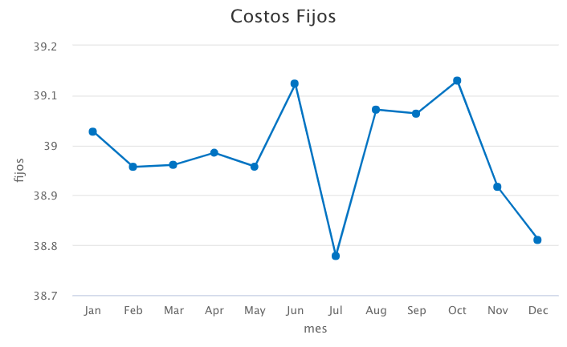
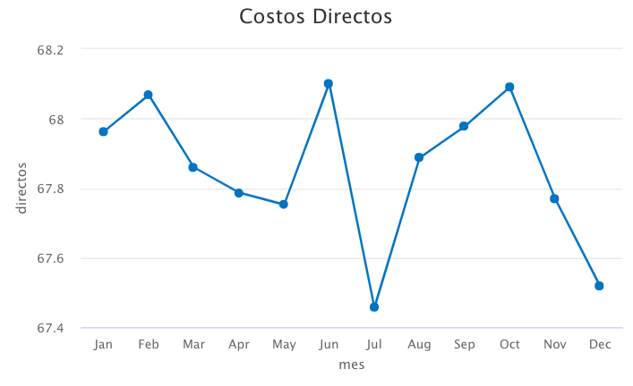

# Ingresos y Análisis de Paretto de postes

``` r
#cuantos postes son, cuantos  representan el 80% 

pareto<-tidy_df %>% 
  group_by(ID) %>% 
  summarise(ingreso = as.numeric(sum(factura))) %>% 
  arrange(-ingreso)

 pareto<-pareto %>%  mutate(postes = row_number(),
         porcentaje_postes = (postes/max(postes)),
         ingresosac = cumsum(ingreso),
         porcentaje_ingresos = (ingresosac/max(ingresosac)))
 
grafica_pareto<- pareto %>% 
  hchart(., type = "line", hcaes(porcentaje_ingresos, porcentaje_postes))%>% 
  hc_title(text=" Porcentaje de Postes vs Porcentaje de Ingresos" ) %>% 
  hc_subtitle(text="El 80% de nuestros ingresos se deben al 47% de nuestros postes aproximadamente") 
```

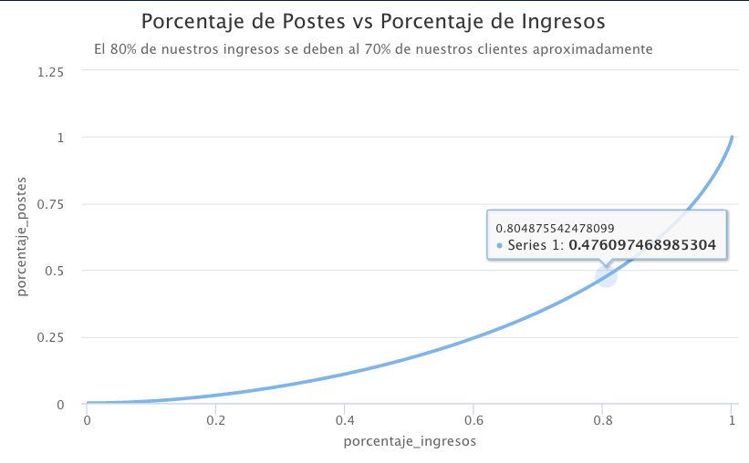 \# costos por transporte y cuales se usan
más en relación a los servicios
requeridos.

``` r
# porque no estamos usando motos para revision si nos deberñia de salir más barato? 

costos_transporte<-tidy_df %>% 
  group_by(Transporte) %>% 
  summarise(costos=sum(CostoFijo),costo_promedio=mean(CostoFijo)) %>% 
  arrange(-costos) 

grafica_costos_transporte<-costos_transporte %>% 
  hchart('column', hcaes(Transporte,costos)) %>% 
  hc_colors(c("#0073C2FF", "#EFC000FF")) %>% 
    hc_title(text="Costos por transporte ") 

grafica_costos_promedio_transporte<-costos_transporte %>% 
  arrange(-costo_promedio) %>% 
  hchart('column', hcaes(Transporte,costo_promedio)) %>% 
  hc_colors(c("#0073C2FF", "#EFC000FF")) %>% 
    hc_title(text="Costo promedio transporte ") 

uso_transporte<-tidy_df %>% 
  group_by(Transporte,Cod) %>% 
  summarise(viajes=n()) %>% 
  arrange(-viajes)
```

    ## `summarise()` has grouped output by 'Transporte'. You can override using the `.groups` argument.

``` r
grafica_uso_transporte<-uso_transporte %>% 
  hchart('column', hcaes(Transporte,viajes,group=Cod)) %>% 
  hc_colors(c("#0073C2FF", "#EFC000FF")) %>% 
    hc_title(text="Viajes por transporte y servicio ") %>% 
    hc_colors(c("#0073C2FF", "#EFC000FF","#FF7F50","    #00FFFF","#191970","    #7FFFD4","#FF7F50","#BDB76B","#BA55D3","#006400"))
```

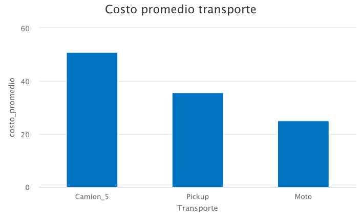
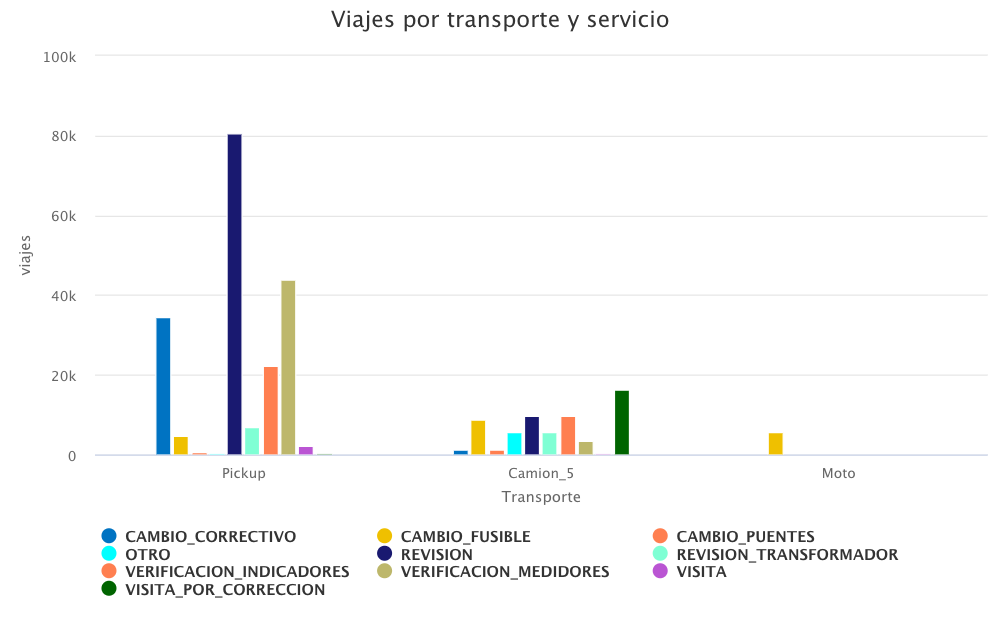

\#costo por recorrido y cual es la distancia a la que más vamos con
relacion al tansporte que se utiliza

``` r
# puede la moto solucionar el problema de los costos?

costos_recorrido<-tidy_df %>% 
  group_by(TiempoRecorrido) %>% 
  summarise(costos=sum(CostoFijo),costo_promedio=mean(CostoFijo)) %>% 
  arrange(-costos) 

grafica_costos_recorrido<-costos_recorrido %>% 
  hchart('column', hcaes(TiempoRecorrido,costos)) %>% 
  hc_colors(c("#0073C2FF", "#EFC000FF")) %>% 
    hc_title(text="Costos por Recorrido ") 

grafica_costos_promedio_recorrido<-costos_recorrido %>% 
  arrange(-costo_promedio) %>% 
  hchart('column', hcaes(TiempoRecorrido,costo_promedio)) %>% 
  hc_colors(c("#0073C2FF", "#EFC000FF")) %>% 
    hc_title(text="Costos promedio por Recorrido ") 

recorrido<-tidy_df %>% 
  group_by(Transporte,TiempoRecorrido) %>% 
  summarise(viajes=n()) %>% 
  arrange(-viajes)
```

    ## `summarise()` has grouped output by 'Transporte'. You can override using the `.groups` argument.

``` r
grafica_recorrido<-recorrido %>% 
  hchart('column', hcaes(Transporte,viajes,group=TiempoRecorrido)) %>% 
  hc_colors(c("#0073C2FF", "#EFC000FF")) %>% 
    hc_title(text="Viajes por transporte y recorrido ") %>% 
    hc_colors(c("#0073C2FF", "#EFC000FF","#FF7F50","    #00FFFF","#191970","    #7FFFD4","#FF7F50","#BDB76B","#BA55D3","#006400"))
```

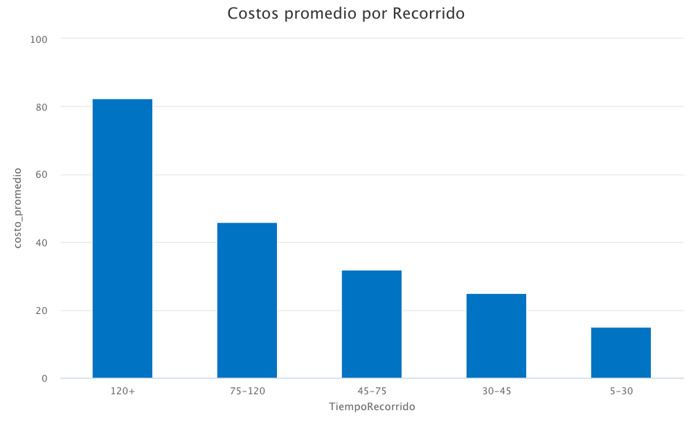
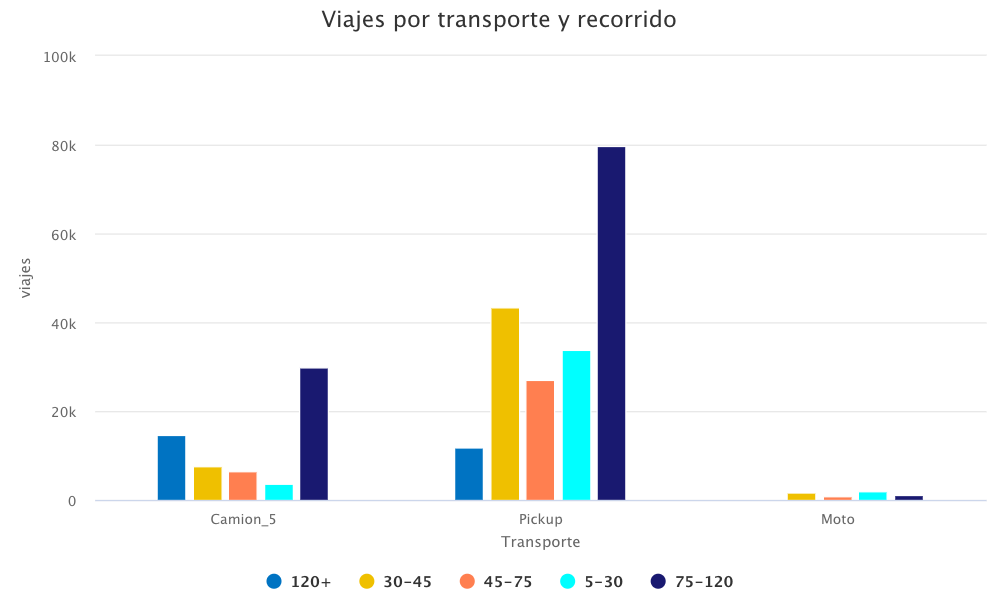 \# recorridos con mayor
margen

``` r
# ofrecer planes de revision más frecuentes, y que el plan de cantidad sea de acuerdo a la distancia de cada uno, tomando en cuenta el margen.

margen_recorrido<-tidy_df %>% 
  group_by(TiempoRecorrido) %>% 
  summarise(margen=percent(1-(sum(CostoTotal)/sum(factura))) ) %>% 
  arrange(-margen) 
kable(margen_recorrido)
```

| TiempoRecorrido | margen |
| :-------------- | -----: |
| 5-30            | 42.61% |
| 30-45           | 31.23% |
| 45-75           | 26.46% |
| 75-120          | 20.52% |
| 120+            | 14.10% |

\#Simulación: Si ahora los servicios de revisión se hicieran en pickup,
pero se cobraría como si igual se hicieran en camión.

``` r
# solución para aumentar el 10% que se quiere de margen operativo. 

costos_transporte_servicio_promedio<-tidy_df %>% 
  group_by(Transporte,Cod) %>% 
  summarise(costo_promedio=mean(CostoFijo),ingreso=mean(factura)) 
```

    ## `summarise()` has grouped output by 'Transporte'. You can override using the `.groups` argument.

``` r
nuevo_precio_revisión<-costos_transporte_servicio_promedio[costos_transporte_servicio_promedio$Transporte=="Camion_5" & costos_transporte_servicio_promedio$Cod=="REVISION",4]

nuevo_costo_revisión<-costos_transporte_servicio_promedio[costos_transporte_servicio_promedio$Transporte=="Pickup" & costos_transporte_servicio_promedio$Cod=="REVISION",3]

nuevo<-tidy_df 
nuevo[nuevo$Transporte=="Pickup" & nuevo$Cod=="REVISION",11]<-nuevo_precio_revisión

nuevo[nuevo$Transporte=="Camion_5" & nuevo$Cod=="REVISION",7]<-nuevo_costo_revisión

nuevo$CostoTotal<-nuevo$CostoFijo+nuevo$CostoDirecto

utilidades_mensuales_nuevas<-nuevo %>% 
  group_by(mes=month(Fecha,label = TRUE)) %>% 
  summarise(ingresos=sum(factura),costos=sum(CostoTotal),margen=1-(sum(CostoTotal)/sum(factura)))

grafica_margen_nuevo<-utilidades_mensuales_nuevas%>% 
  hchart('line', hcaes(mes,margen)) %>% 
  hc_colors(c("#0073C2FF", "#EFC000FF")) %>% 
    hc_title(text="Margen mensual nuevo") 


margen_anual_actual<-1-(sum(utilidades_mensuales$costos)/sum(utilidades_mensuales$ingresos))

percent(margen_anual_actual)
```

    ## [1] 23.21%

``` r
margen_anual_nuevo<-1-(sum(utilidades_mensuales_nuevas$costos)/sum(utilidades_mensuales_nuevas$ingresos))

percent(margen_anual_nuevo)
```

    ## [1] 32.29%

``` r
diferencia<-margen_anual_nuevo-margen_anual_actual
percent(diferencia)
```

    ## [1] 9.08%

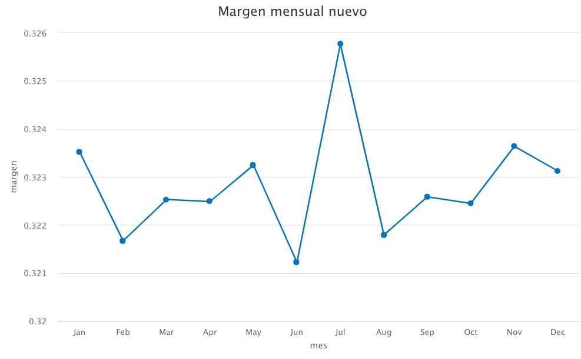
