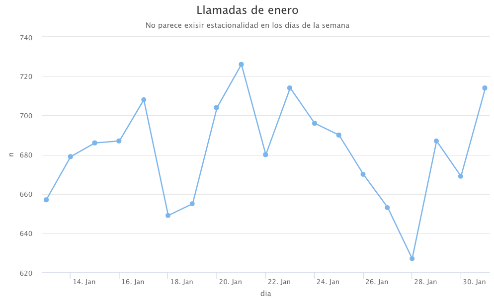

# Parte 1: Predecir un eclipse solar
```{r message=FALSE, warning=FALSE}
library(lubridate)
eclipse_historico<- mdy_hms("August 21st, 2017,18:26:40")
synodic_month<-days(29)+hours(12)+minutes(44)+seconds(3)
saros<- synodic_month * 223


eclipse_siguiente<-eclipse_historico+saros
eclipse_siguiente
```

# Parte 2: Agrupaciones y operaciones con fechas

Se decidió eliminar los datos con fechas ambiguas, que no soportó lubridate debido a que no se pudo convertir las fechas de una manera eficiente debido al typo encontrado en algunas fechas en excel. Además, se decidió eliminar aquellas filas donde no se tuviera Cod. En conclusión, se trabajará con una data más resumida, pero ajustada y completa para hacer un análisis más integro. 

Se entiende como "ocupado" la cantidad de llamadas que se recibieron en el periodo de tiempo determinado. 
```{r message=FALSE, warning=FALSE}


library(readxl)
data<-read_excel("data.xlsx")
data$`Fecha Creación`<-dmy(data$`Fecha Creación`)
data$`Fecha Final`<-dmy(data$`Fecha Final`)
data$`Hora Creación`<- hms(substring(data$`Hora Creación`, 12, 19))
data$`Hora Final` <- hms(substring(data$`Hora Final`, 12, 19))
data$Cod[data$Cod==0]<-NA
data<-na.omit(data)
```

* ¿En qué meses existe una mayor cantidad de llamadas por código?
```{r message=FALSE, warning=FALSE}
library(dplyr)
library(knitr)
llamadas_meses<- data %>% 
  mutate(mes=month(`Fecha Creación`)) %>% 
  group_by(Cod, mes) %>% 
  tally()

  respuesta<-NA

  maximos <- function(llamadas_meses,unicos){
  llamadas_meses %>% 
    select (Cod,mes,n) %>% 
    filter(Cod==unicos, n==max(n)) 
  
 
}
unicos<-unique(llamadas_meses$Cod)  


respuestas <-  rbind(maximos(llamadas_meses,unicos[1]),
                     maximos(llamadas_meses,unicos[2]),
                     maximos(llamadas_meses,unicos[3]),
                     maximos(llamadas_meses,unicos[4]),
                     maximos(llamadas_meses,unicos[5]),
                     maximos(llamadas_meses,unicos[6]))

respuestas$mes<-month(respuestas$mes, label=TRUE, abbr=FALSE)
kable(respuestas,align = "c",caption = "Maximo de llamadas por codigo")                  


   
```
* ¿Qué día de la semana es el más ocupado?
```{r}
día_ocupado <- data %>%
  group_by(dia_mas_ocupado=weekdays(ymd(`Fecha Creación`))) %>% 
  tally() %>% 
  filter(n==max(n))
kable(día_ocupado)
```
* ¿Qué mes es el más ocupado?
```{r}
mes_ocupado <- data %>%
  group_by(mes_mas_ocupado=month(ymd(`Fecha Creación`),label = TRUE,abbr = FALSE)) %>% 
  tally() %>% 
  filter(n==max(n))
kable(mes_ocupado)
```

4.	¿Existe una concentración o estacionalidad en la cantidad de llamadas?
```{r message=FALSE, warning=FALSE}
library(highcharter)
mensual <- data %>%
  group_by(mes=month(ymd(`Fecha Creación`),label = TRUE,abbr = FALSE)) %>% 
  tally() %>% 
  hchart("line",hcaes(mes,n)) %>% 
  hc_title(text="Llamadas por mes" ) %>% 
  hc_subtitle(text="Parece fluctuar cada mes, pero no en valores significativos")


enero <- data %>%
  group_by(dia=ymd(`Fecha Creación`)) %>% 
  filter(month(dia)==01) %>% 
  tally() %>% 
  hchart("line",hcaes(dia,n)) %>% 
  hc_title(text="Llamadas de enero" ) %>% 
  hc_subtitle(text="No parece exisir estacionalidad en los días de la semana")


```



Por lo que he analizado en la gráfica mensual, existe un pequeña estacionalidad alternando cada mes, pero me parece muy pequeña como para ser significativa. El cambio en llamadas es mínimo en comparación a la cantidad de llamadas que son. Después que además, se analizó la gráfica del mes de enero para analizar estacionalidad diaria, también se descarta una estacionalidad en los días de la semana. Realmente no se encontró un patrón específico ni relevante. 

* ¿Cuántos minutos dura la llamada promedio?
```{r message=FALSE, warning=FALSE}
#Se eliminaron datos de las horas que tenían typos en excel para mejorar el análisis.
tiempo_de_llamada <- data  %>% 
  mutate(inicio=make_datetime(day=day(ymd(`Fecha Creación`)), month=month(ymd(`Fecha Creación`)),
                              year=year(ymd(`Fecha Creación`)), hour=hour(`Hora Creación`),
                              min=minute(`Hora Creación`), sec=seconds(`Hora Creación`)),
         fin=make_datetime(year=year(ymd(`Fecha Final`)), month=month(ymd(`Fecha Final`)), 
                           day=day(ymd(`Fecha Final`)), hour=hour(`Hora Final`),
                           min=minute(`Hora Final`), sec=seconds(`Hora Final`))) %>% 
  mutate(diferencia=difftime(fin, inicio, units='mins')) %>% 
  select(`Hora Creación`,`Hora Final`,diferencia) %>% 
  filter(diferencia>0)

cat("La llamada promedio dura",round(mean(tiempo_de_llamada$diferencia)), "minutos")
```
* Realice una tabla de frecuencias con el tiempo de llamada.

```{r message=FALSE, warning=FALSE}
tabla_frecuencias <- table(tiempo_de_llamada$diferencia) %>%
  as.data.frame() 

tabla_frecuencias<-rename(tabla_frecuencias, "Tiempo de llamada en minutos"="Var1","Cantidad de llamadas"="Freq")


kable(tabla_frecuencias,align = "c")

```

# Parte 3: Signo Zodiacal
```{r message=FALSE, warning=FALSE}

signo_zodiacal<- function(fecha){
  fecha<- ymd(fecha)
  
  if(fecha>=make_date(year(fecha),12,22) & fecha<=make_date(year(fecha),1,19) ){
    return("Capricorn")
  }
  if(fecha>=make_date(year(fecha),1,20) & fecha<=make_date(year(fecha),2,17) ){
    return("Aquarious")
  }
  if(fecha>=make_date(year(fecha),2,18) & fecha<=make_date(year(fecha),3,19) ){
    return("Pisces")
    }
  if(fecha>=make_date(year(fecha),3,20) & fecha<=make_date(year(fecha),4,19) ){
    return("Aries")
    }
  if(fecha>=make_date(year(fecha),4,20) & fecha<=make_date(year(fecha),5,19) ){
    return("Tauros")
    }
  if(fecha>=make_date(year(fecha),5,20) & fecha<=make_date(year(fecha),6,20) ){
    return("Gemini")
    }
  if(fecha>=make_date(year(fecha),6,21) & fecha<=make_date(year(fecha),7,21) ){
    return("Cancer")
    }
  if(fecha>=make_date(year(fecha),7,22) & fecha<=make_date(year(fecha),8,22) ){
    return("Leo")
    }
  if(fecha>=make_date(year(fecha),8,23) & fecha<=make_date(year(fecha),9,21) ){
    return("Virgo")
    }
  if(fecha>=make_date(year(fecha),9,22) & fecha<=make_date(year(fecha),10,22) ){
    return("Libran")
    }
  if(fecha>=make_date(year(fecha),10,23) & fecha<=make_date(year(fecha),11,21) ){
    return("Scorpio")
    }
  if(fecha>=make_date(year(fecha),11,22) & fecha<=make_date(year(fecha),12,21) ){
    return("Sagittarius")
    }
}

#format YYYY-MM-DD
signo_zodiacal("2000-03-14")

```

# Flights

* Genere 4 nuevas columnas para cada variable con formato fecha y hora.
```{r message=FALSE, warning=FALSE}
library(nycflights13)
library(DT)

new_flights<-flights %>% 
  mutate(new_dep_time=make_datetime(year, month, day, dep_time %/%100,dep_time %%100),
         new_sched_dep_time=make_datetime(year, month, day, sched_dep_time %/%100,sched_dep_time %%100),
         new_arr_time=make_datetime(year, month, day, arr_time %/%100,arr_time %%100),
         new_sched_arr_time=make_datetime(year, month, day, sched_arr_time %/%100,sched_arr_time %%100)) %>% 
  select(year, month, day,new_dep_time, new_sched_dep_time,new_arr_time, new_sched_arr_time) 
  

  
kable(head(new_flights))


```
* 2.	Encuentre el delay total que existe en cada vuelo. El delay total se puede encontrar sumando el delay de la salida y el delay de la entrada.

```{r message=FALSE, warning=FALSE}
delay_total <- flights %>% 
  mutate(delay_total= minutes(dep_delay+arr_delay)) %>% 
  select(flight, delay_total)

kable(head(delay_total,10))
  
```

