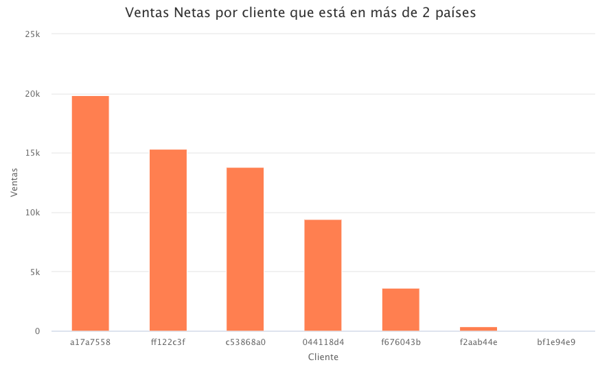

# Examen parcial Luis Pedro Zenteno

Indicaciones generales:

* Usted tiene el período de la clase para resolver el examen parcial.
* La entrega del parcial, al igual que las tareas, es por medio de su cuenta de github, pegando el link en el portal de MiU.


* Pueden hacer uso del material del curso e internet (stackoverflow, etc.). Sin embargo, si encontramos algún indicio de copia, se anulará el exámen para los estudiantes involucrados. Por lo tanto, aconsejamos no compartir las agregaciones que generen. 

## Sección I: Preguntas teóricas.

* Existen 10 preguntas directas en este Rmarkdown, de las cuales usted deberá responder 5. Las 5 a responder estarán determinadas por un muestreo aleatorio basado en su número de carné.

* Ingrese su número de carné en  `set.seed()` y corra el chunk de R para determinar cuáles preguntas debe responder.


```{r, echo=TRUE, cache=TRUE}

set.seed(20190516) 
v<- 1:10
preguntas <-sort(sample(v, size = 6, replace = FALSE ))

paste0("Mis preguntas a resolver son: ",paste0(preguntas,collapse = ", "))

```


### Listado de preguntas teóricas

1. Para las siguientes sentencias de `base R`, liste su contraparte de `dplyr`:

  * `str()`
```
  glimpse()
```

* `df[,c("a","b")]`

```
   df %>% 
   select("a","b")
```
  
* `names(df)[4] <- "new_name"` donde la posición 4 corresponde a la variable `old_name`
```
   df %>% 
   rename('old_name'='new_name')
``` 
* `df[df$variable == "valor",]`

```
  df %>% 
  select(variable) %>%
  filter(variabe= "valor")
```

3. ¿Por qué en R utilizamos funciones de la familia apply (lapply,vapply) en lugar de utilizar ciclos?

* Primero que nada, las funciones de la familia apply permiten tener más ordenado y limpio el código. Además, permiten realizar una función en especíco a un grupo de elementos al mismo tiempo cuando se manda a llamar la función de  apply , ya sea una lista o vector por lo que simplifica las lineas de código para poder lograrlo. Además, se dice que es más rápido a nivel de eficiencia usar las funciones de apply, que usar ciclos. 

4. ¿Cuál es la diferencia entre utilizar `==` y `=` en R?

* Se utiliza `==` cuando se quiere hacer una evaluación lógica, mientras que `=`se utiliza para asignar valores a una variable. 
  

5. ¿Cuál es la forma correcta de cargar un archivo de texto donde el delimitador es `:`?

*  La forma correcta para cargar el archivo es las siguiente: `textfile <- read_delim('archivo.txt', delim=':')`


7. ¿Qué pasa si quiero agregar una nueva categoría a un factor que no se encuentra en los niveles existentes?

* En factores, una categoria se interpreta como un nivel. Si lo que se desea es agregar un nivel, siempre y cuando se agregue la nueva categoria al vector que irá en la funcion factor(), no habrá ningún problema, *se agregará correctamente* . 
  


8. Si en un dataframe, a una variable de tipo `factor` le agrego un nuevo elemento que *no se encuentra en los niveles existentes*, ¿cuál sería el resultado esperado y por qué?

* El nuevo elemento de la variable de tipo factor será `<NA>` , y arrojará un warning:   `invalid factor level, NA generated`. Esto porque no hay una categoría existente para poder identificarlo, y como no la encuentrá, es por eso que el resultado es `NA`. 
    
Extra: ¿Cuántos posibles exámenes de 5 preguntas se pueden realizar utilizando como banco las diez acá presentadas?
(responder con código de R.)

```{r}
library(gtools)
respuesta<-factorial(10) / (factorial(5) * (factorial(5)))
comprobación<-choose(10,5)
cat("Son posibles ",respuesta,"exámenes de 5 peguntas con un banco de 10 preguntas.")

```


## Sección II Preguntas prácticas.


* Conteste las siguientes preguntas utilizando sus conocimientos de R. Adjunte el código que utilizó para llegar a sus conclusiones en un chunk del markdown.

A. De los clientes que están en más de un país,¿cuál cree que es el más rentable y por qué?

B. Estrategia de negocio ha decidido que ya no operará en aquellos territorios cuyas pérdidas sean "considerables". Bajo su criterio, ¿cuáles son estos territorios y por qué ya no debemos operar ahí?


### I. Preguntas teóricas


## A

Primero que nada, se determinó que no es el mismo precio al que se vendieron las unidades. Por lo tanto, se evidencia que se trata de diferentes productos *(en este caso se asumirá que son tomates y su variedad de tamaños afecta el precio)*, por lo que no se analizáran suma de unidades de plaza para el análisis de rentabilidad (no es significativo de ingresos). Además, se asume las unidades y ventas negativas como pérdidas, lo cual hace sentido asumiendo que los tomates llegan a ser périddas después de cierto tiempo que no se pueden vender. Se dejarán en el análisis para hacer la suma de ventas y así brindar una rentabilidad más efectiva.

```{r message=FALSE, warning=FALSE}
library(dplyr)
library(knitr)
library(highcharter)
parcial_anonimo <- readRDS("~/Desktop/UFM/SEXTO SEMESTRE/Data Wrangling/GitHub/Data-Wrangling/parcial_1_data_wrangling/parcial_anonimo.rds")

parcial_anonimo$precio<-parcial_anonimo$Venta/parcial_anonimo$`Unidades plaza`

ventas_clientes <- parcial_anonimo %>%
  select(Cliente, Pais, Venta) %>% 
  group_by(Cliente) %>%
  summarise(Cliente=unique(Cliente),Paises=n_distinct(Pais),Ventas=sum(Venta)) %>% 
  filter(Paises>1)

#Cliente con más ventas es en teoria el más rentable, ya que esta suma también incluye las perdidas
cliente_max_ventas<- ventas_clientes %>% 
  filter(Ventas==max(Ventas))
kable(cliente_max_ventas,align = "c")

```

El Cliente con más ventas netas de tomates en teoria el más rentable, ya que esta suma de ventas también incluye las perdidas. Por lo tanto:
```{r echo=FALSE, message=FALSE, warning=FALSE}
cat("El cliente más rentable es:",cliente_max_ventas$Cliente, "con ventas de Q.",cliente_max_ventas$Ventas,"en tomates y actualmente está en",cliente_max_ventas$Paises,"paises.")
```


## B
En este análisis también se consideran las cantidades y ventas negativs como pérdidas. Por lo tanto, el criterio para "pérdidas considerables" sera aquellos Territorios que este una desviación estándar por arriba de la media de pérdidas por territorio, que además, no sean territorios significativos en ventas. Es decir, no estén en el TOP 10 de los territorios según la tabla de Pareto. Esto porque se hace evidente que muchos terrotorios al tener más ventas, generarán más perdidas. Pero si no están en el TOP 10 de Pareto, es probable que no sean tan significativas sus ventas. 
```{r }
library(dplyr)
library(formattable)
perdidas_territorio<- parcial_anonimo %>% 
  select(Territorio,Venta) %>% 
  filter(Venta<0) %>% 
  group_by(Territorio) %>% 
  summarise(Territorio=unique(Territorio),Perdidas=sum(Venta))

summary(perdidas_territorio$Perdidas)
media<-mean(perdidas_territorio$Perdidas)
desviacion<-sd(perdidas_territorio$Perdidas)
considerable<-media-desviacion

territorios_perdida_considerable<- perdidas_territorio %>% 
  filter(Perdidas<considerable)

kable(territorios_perdida_considerable,caption = "Territorios con perdidas considerables")


#pareto solo para saber si algún territorio es más significativo en las ventas
pareto<-parcial_anonimo %>% 
  group_by(Territorio) %>% 
  summarise(Ventas = sum(Venta))%>% 
  arrange(-Ventas)

pareto<-pareto %>%  mutate(Territorios = row_number(),
         porcentaje_territorios = (Territorios/max(Territorios)),
         ventas_ac = cumsum(Ventas),
         porcentaje_ventas = (ventas_ac/max(ventas_ac)))
top_10_territorios<-pareto[1:10,]

kable(top_10_territorios,caption = "TOP 10 Territorios en tabla Pareto")
 
respuesta<-left_join(territorios_perdida_considerable,top_10_territorios)

respuesta<-respuesta %>% 
  arrange(Ventas) %>% 
  select(Territorio,Perdidas) %>% 
  tail(2)

kable(respuesta,caption = "Territorios con perdidas considerables, sin ventas significativas")

```

```{r echo=FALSE, message=FALSE, warning=FALSE}
cat("Los territorios con pérdidas más considerables son: ",respuesta$Territorio[1],"y",respuesta$Territorio[2])
```
Son aquellos territorios que sus perdidas estan una desviación estándar por arriba de la media de pérdidas, y tampoco  están en el TOP 10 Territorios que representa el 50% de las ventas de la empresa. Si no se toma en cuenta el factor de importancia en ventas, los territorios a eliminar son 7 territorios de la tabla "territorios_perdida_considerable"

